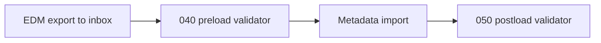

# epminbox

Generic Oracle EPM Groovy rule templates you can copy into a client project, configure, and deploy in Calculation Manager.

Each script is **self-contained** (EPM cannot import shared helper files). Client-specific values live in a top-level `Config` / `RuleConfig` / `ValidationConfig` class.

## Catalog

| Script | Purpose | Docs |
|---|---|---|
| [`groovy-rules/000-groovy-rule-template.groovy`](groovy-rules/000-groovy-rule-template.groovy) | Blank starter with required header + `runRule()` | — |
| [`groovy-rules/020-close-period-subvar.groovy`](groovy-rules/020-close-period-subvar.groovy) | Derive/update/validate close-period substitution variables | [docs/020-close-period-subvar.md](docs/020-close-period-subvar.md) |
| [`groovy-rules/025-run-pipeline-from-rtps.groovy`](groovy-rules/025-run-pipeline-from-rtps.groovy) | Launch a Data Management pipeline from runtime prompts | [docs/025-run-pipeline-from-rtps.md](docs/025-run-pipeline-from-rtps.md) |
| [`groovy-rules/030-copy-from-sftp.groovy`](groovy-rules/030-copy-from-sftp.groovy) | Copy a file from SFTP into inbox (replace if present) | [docs/030-copy-from-sftp.md](docs/030-copy-from-sftp.md) |
| [`groovy-rules/040-validate-edm-metadata-preload.groovy`](groovy-rules/040-validate-edm-metadata-preload.groovy) | Pre-import EDM vs EPM metadata gate | [docs/040-050-validate-edm-metadata.md](docs/040-050-validate-edm-metadata.md) |
| [`groovy-rules/050-validate-edm-metadata-postload.groovy`](groovy-rules/050-validate-edm-metadata-postload.groovy) | Post-import EDM vs EPM metadata reconcile | [docs/040-050-validate-edm-metadata.md](docs/040-050-validate-edm-metadata.md) |

Sequence numbers suggest a typical close/metadata pipeline order. They are **not** a required deploy order.

## How to use

1. Copy the script into your client integration folder (or paste into Calculation Manager).
2. Edit the config class at the top: connection names, dimensions, file tokens, thresholds, naming conventions.
3. Create any required named connections in EPM (`EPM_INTERNAL_REST`, and for 030 `EPM_COPY_FROM_SFTP`).
4. Attach runtime prompts (RTPs) as documented for that rule.
5. Validate in a lower environment before production.

Engineering conventions and known EPM Groovy compile pitfalls:

- [docs/groovy-rule-engineering-standards.md](docs/groovy-rule-engineering-standards.md)
- [docs/epm-groovy-compile-fixes.md](docs/epm-groovy-compile-fixes.md)

## What is intentionally excluded

These patterns are too client-specific to ship as templates:

- Sequential / historical multi-period Data Integration runners (fixed job name lists, period-batch parallel DI, consolidate POV orchestration)
- Deprecated close-subvar wrappers and non-deployable helper stubs
- SQL mappings and calc scripts (`.csc`) — this library is **Groovy only**

## Typical metadata validation flow

## Typical close-file staging flow

